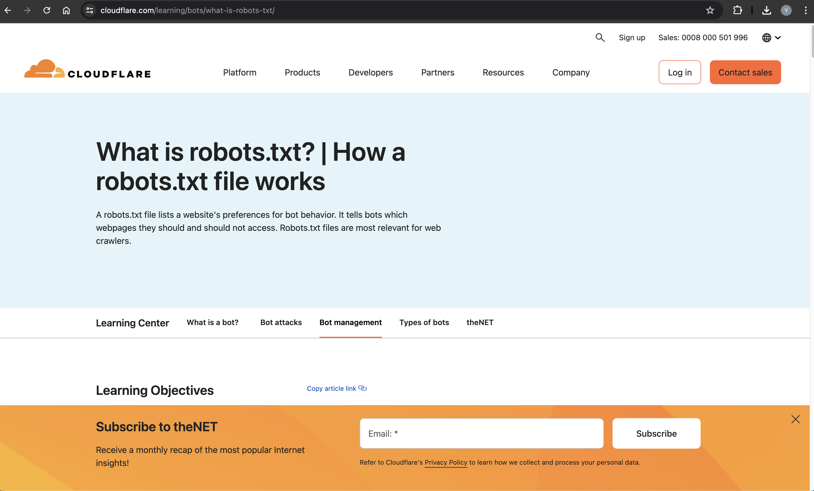
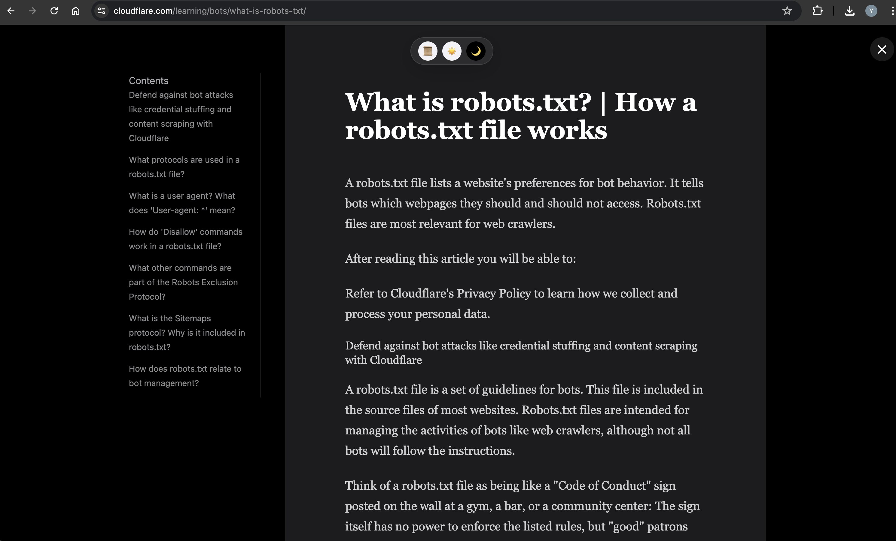

# Bunker Reader

Transform cluttered web pages into a beautiful, distraction-free reading experience inspired by Safari’s Reading Mode.

Bunker Reader intelligently extracts article content from any webpage and presents it in a clean overlay with refined typography, smooth navigation, and theme controls.

---

## Images
* Before Extension


* After Extension


## ✨ Features

* **Smart Article Detection**
  Automatically finds the most relevant content container using semantic tags and content scoring heuristics.

* **Clean Typography Overlay**
  Displays extracted content in a centered reading canvas.

* **Theme Switching**

  * Paperlike
  * Light
  * Dark

* **Auto-generated Table of Contents**
  Builds a navigable TOC from detected `h2` and `h3` headings.

* **Noise Filtering**
  Removes short, irrelevant, or common distraction patterns (cookie banners, subscribe prompts, etc).

* **Smooth Scrolling Navigation**

* **Non-destructive Mode**
  Original page remains untouched. Reading mode is an overlay that can be exited instantly.

---

## 🧠 How It Works

### 1. Content Detection

The extension scans the page and:

* Prefers semantic containers like `<article>` or `<main>`
* Scores `div`, `section`, and `article` elements based on paragraph density and text length
* Selects the highest scoring visible container

### 2. Content Extraction

* Extracts `h2`, `h3`, and `p` elements
* Filters out short or promotional content
* Builds structured blocks for rendering

### 3. Overlay Rendering

* Injects a full-screen reading interface
* Loads isolated stylesheet (`styles.css`)
* Locks background scroll

### 4. Interaction Layer

* Theme switching
* Exit button
* Auto-generated Table of Contents with smooth scrolling

---

## 📦 Tech Stack

* Chrome Extension (Manifest V3)
* Content Scripts
* DOM Traversal & Heuristic Scoring
* Dynamic CSS Injection
* Chrome Runtime Messaging

---

## 🛠 Installation (Manual)

1. Clone or download this repository
2. Open Chrome and go to: `chrome://extensions`
3. Enable **Developer Mode**
4. Click **Load Unpacked**
5. Select the project folder

---

## 📁 Project Structure

```
.
├── manifest.json
├── content.js
├── styles.css
├── popup.html
└── icons/
```

---

## 🎯 Goal

Bunker Reader aims to bring Safari-style reading clarity to Chrome users while remaining lightweight, fast, and visually elegant.

This project focuses on:

* Practical DOM intelligence
* UI isolation inside hostile web environments
* Clean reading ergonomics

---

## 🔗 Author

github.com/OnlineBunker

---

## 🚀 Future Ideas

* AI-based article summarization
* Reading time estimation
* Focus timer integration
* Custom font controls
* Persistent theme memory
* Domain-based auto-enable

---

## License

MIT
